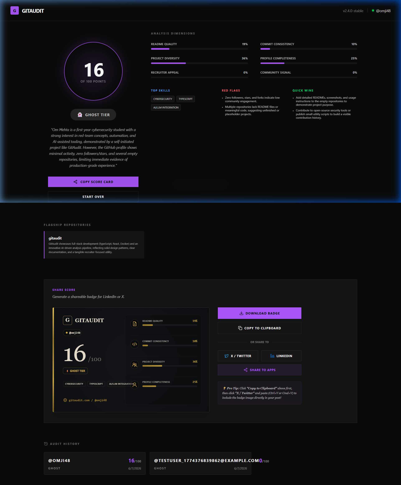

# 🔍 GitAudit — Know exactly why your GitHub isn't getting you hired.

[](https://www.python.org/)
[](https://vitejs.dev/)
[](https://www.docker.com/)
[](https://ollama.com/)
[](#license)

## What it does
- Fetches your GitHub profile + repositories (including READMEs and commit history).
- Runs local AI analysis using Ollama (no external data sharing).
- Produces a recruiter-ready score + tier with clear, actionable insights.

## Screenshot


## Quick Start
```bash
git clone https://github.com/YOUR_USERNAME/gitaudit
cd gitaudit
cp .env.example .env
# Edit .env with your GitHub token
docker-compose up --build
# Open http://localhost:3000
```

## How it works (pipeline phases)
1. **Fetching**: GitHub profile + repos metadata (REST + GraphQL)
2. **Analyzing**: README + repo signals via local Ollama
3. **Scoring**: Translate signals into 6 dimension scores
4. **Tiering**: Map overall score to a hiring tier
5. **Export**: Write results to `data/final_score.json` for the UI

## Tier system
| Tier | Range |
|------|--------|
| Ghost | 0–20 |
| Lurker | 21–40 |
| Builder | 41–60 |
| Operator | 61–80 |
| Rockstar | 81–100 |

## Privacy
All AI analysis runs locally via Ollama. Your code never leaves your machine.

## Contributing
Pull requests are welcome. If you find a bug, please open an issue with:
- expected behavior
- actual behavior
- relevant logs/output

## License
MIT
